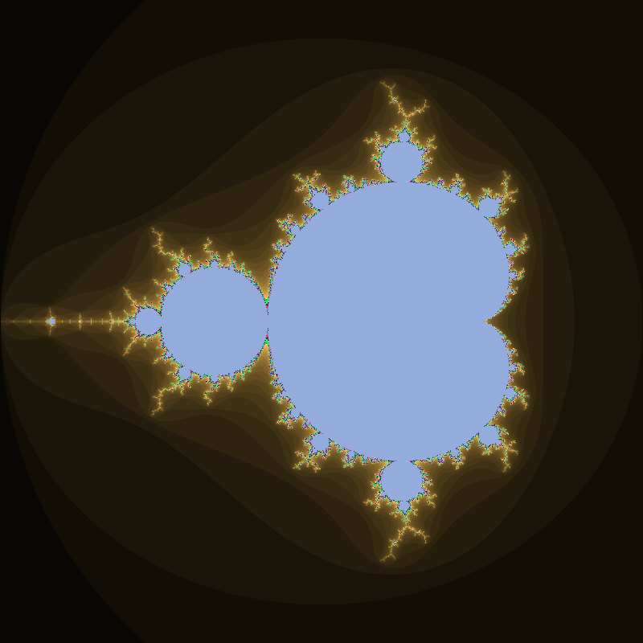
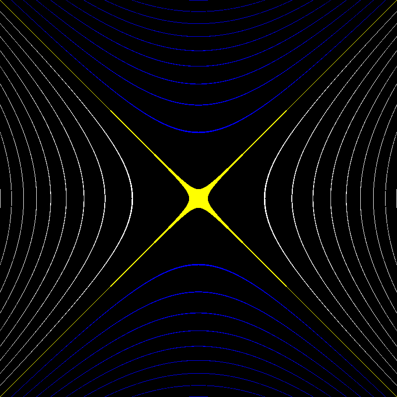

# Quad-Algebra

A modern header-only C++ library implementing quadratic algebraic extensions of the real numbers.

Supported algebras:

* Complex Numbers (`i² = -1`)
* Split-Complex Numbers (`j² = 1`)
* Dual Numbers (`ε² = 0`)

---

## Features

### Complex Numbers

* Arithmetic operations
* Conjugation
* Norm and modulus
* Exponential and logarithm
* Power and square root
* Trigonometric and inverse functions
* Hyperbolic and inverse functions
* Mandelbrot set generation

### Split-Complex Numbers

* Arithmetic operations
* Hyperbolic norm
* Exponential and logarithm
* Trigonometric and inverse functions
* Hyperbolic and inverse functions
* Lorentz-style geometry visualization

### Dual Numbers

* Arithmetic operations
* Exponential and logarithm
* Trigonometric and inverse functions
* Hyperbolic and inverse functions
* Automatic differentiation support

---

## Project Structure

```text
Quad-Algebra/
├── include/
│   └── quad/
│       ├── Complex.hpp
│       ├── Dual.hpp
│       ├── Split_Complex.hpp
│       └── Functions.hpp
│
├── examples/
│   ├── Mandelbrot.cpp
│   ├── SplitGeometry.cpp
│   └── AutoDiff.cpp
│
├── tests/
│   └── Identities.cpp
│
├── images/
│   ├── mandelbrot.png
│   └── split_geometry.png
│
├── LICENSE
├── README.md
└── .gitignore
```

---

## Example

```cpp
#include "quad/Complex.hpp"
#include "quad/Functions.hpp"

using namespace quad;

int main()
{
    Complex<double> z(1.0, 2.0);

    std::cout << sin(z) << '\n';
    std::cout << exp(z) << '\n';
}
```

---

## Compilation

Compile examples using:

```bash
g++ examples/Mandelbrot.cpp -Iinclude -std=c++20 -O2 -o Mandelbrot
```

Compile tests:

```bash
g++ tests/Identities.cpp -Iinclude -std=c++20 -O2 -o Identities
```

---

## Mathematical Identities Verified

Complex Numbers:

```math
\sin^2(z)+\cos^2(z)=1
```

```math
\cosh^2(z)-\sinh^2(z)=1
```

Split-Complex Numbers:

```math
\sin^2(z)+\cos^2(z)=1
```

```math
\cosh^2(z)-\sinh^2(z)=1
```

Dual Numbers:

```math
\sin^2(z)+\cos^2(z)=1
```

```math
\cosh^2(z)-\sinh^2(z)=1
```

---

## Gallery

### Mandelbrot Set



Generated using the custom `Complex<T>` implementation.

### Split-Complex Geometry



Generated using the custom `Split_Complex<T>` implementation.
Contours of the split-complex norm

```math
x^2-y^2=k.
```

---

## Future Plans

* Quaternions
* Clifford Algebras
* Octonions
* Matrix interoperability
* Numerical solvers
* Additional geometry visualizations

---

## License

Licensed under the Apache License 2.0.
